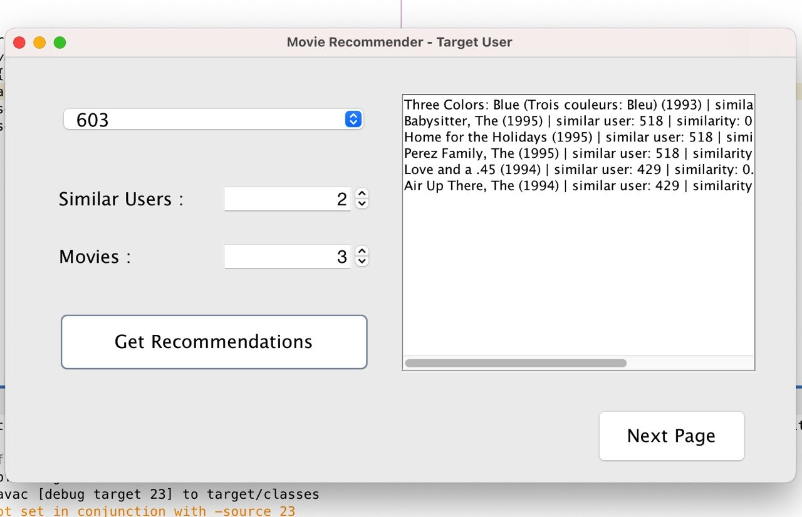
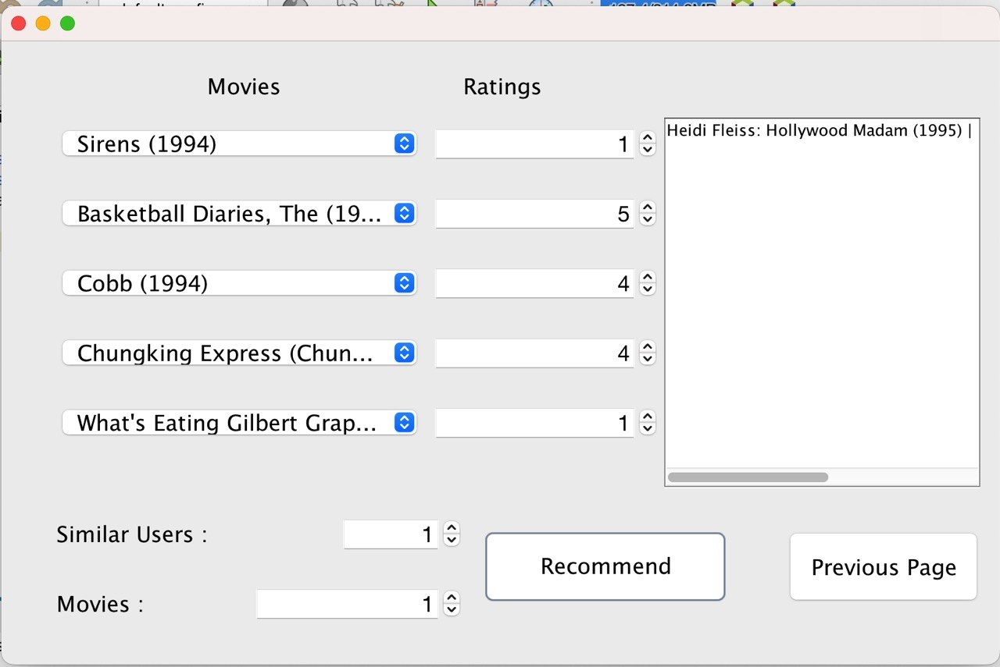
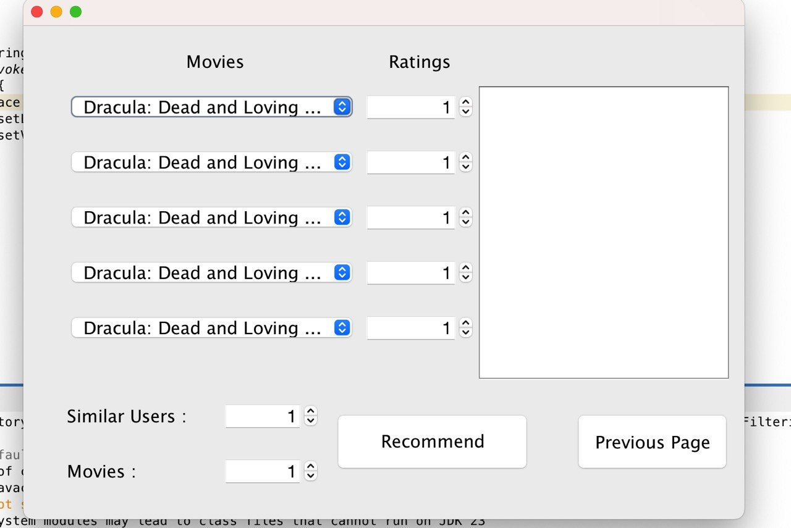

# Movie Recommendation System

A Java Swing desktop application that recommends movies using heap-based collaborative filtering.

The system recommends movies in two ways:

- By selecting an existing target user
- By creating a new user profile using manual movie ratings

---

## Features

### Existing User Recommendation

- Select a target user from `target_user.csv`
- Enter number of similar users (**X**)
- Enter number of movies per user (**K**)
- Compute cosine similarity against all users
- Store users in Max Heap
- Extract most similar users
- Display recommended movie names only
- Prevent duplicate recommendations

---

### New User Recommendation

- Select 5 different movies
- Enter ratings from **1–5**
- Build a user vector
- Compute cosine similarity with existing users
- Store similar users in heap
- Retrieve top movie recommendations
- Ignore movies already rated by user
- Prevent duplicate selections

---

## Project Screenshots

### Target User Screen - Design Preview

<p align="center">
  
</p>

---

### Target User Recommendation Output

<p align="center">
  
</p>

---

### Manual Movie Rating Screen

<p align="center">
  
</p>

---

### Duplicate Movie Selection Validation

<p align="center">
  
</p>

---

## Data Structures Used

### Max Heap

Used to store users according to similarity score.

Functions:

- Insert
- Extract maximum
- Heapify

The root always keeps the most similar user.

---

### HashMap

Used for:

- Movie ID → movie name
- Movie ID → column index
- Column index → movie ID

---

### ArrayList

Used for:

- Users
- Recommendations
- Target users
- Random movie selections

---

## Recommendation Algorithm

### Existing User

1. Select target user
2. Read ratings
3. Compute cosine similarity
4. Insert users into heap
5. Extract top X users
6. Get top K movies
7. Display total **X × K** recommendations

---

### New User

1. Select 5 movies
2. Enter ratings
3. Convert into vector
4. Compute similarity
5. Insert users into heap
6. Extract top users
7. Skip already rated movies
8. Show recommendations

---

## Project Files

```text
src/
├── GUI.java
├── GUI2.java
├── Main.java
├── MovieRecommendationSystem.java
├── MaxHeap.java
├── HeapNode.java
└── UserRating.java

main_data.csv
movies.csv
target_user.csv
pom.xml
README.md
```

---

## Technologies Used

- Java
- Java Swing
- Maven
- CSV file handling
- Heap data structure
- Cosine similarity

---

## How to Run

Make sure these files are together:

```text
DataStructuresProject2-1.0-SNAPSHOT.jar
main_data.csv
movies.csv
target_user.csv
```

Then run the JAR file.

---

## Example Output

```text
Heat (1995) | similar user: 93 | similarity: 0.0392
Batman (1989) | similar user: 93 | similarity: 0.0392
```

---

## Course Information

This project was developed for the **Data Structures** course.

Main concepts used:

- Heap
- Collaborative filtering
- Cosine similarity
- CSV processing
- Java Swing GUI
